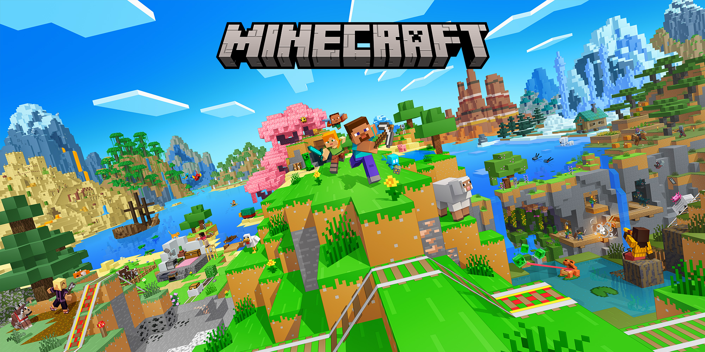

# Cubeon Minecraft Launcher

A free desktop Minecraft launcher for playing with friends - offline/cracked
accounts, one-click modded launches, a shared skin network so players can see
each other's skins on **any** server, and built-in world hosting via tunnels.

Built with Python + Flet. No Mojang account hehe, no paywall.



## Quick Links

| Audience | Start Here |
|----------|------------|
| **Players** | [Simple Owner Guide](docs/SIMPLE_OWNER_GUIDE.md) - run, build, troubleshoot |
| **Developers** | [Development Setup](docs/development/setup.md) - environment, run, debug |
| **Contributors** | [Development Workflow](docs/development/development-workflow.md) - testing, PRs, releases |
| **Architects** | [Architecture Overview](docs/architecture/overview.md) - system design |

## Features

- **Offline/cracked login** - any 3–16 character username. Your identity is a
  stable UUID (`~/.cubeon_launcher/auth_key.json`) that survives renames.
- **Version manager** - browse releases/snapshots, auto-download on first launch.
- **Mod loaders** - Vanilla, Fabric, Quilt, Forge, NeoForge; auto-installs the
  loader for the chosen version. Per-profile mods synced at launch.
- **Skin network** - upload your skin; other Cubeon players see it in-game on
  any server via CustomSkinLoader + Cloudflare Worker. Every Cubeon player also
  wears the shared Cubeon cape automatically.
- **Friends** - unique Cubeon names, presence, chat, groups, voice signalling.
- **Host-a-world / tunneling** - invite codes that turn into tunnel addresses.
- **Modpacks** - install/manage modpacks per version+loader profile.
- **Settings** - RAM slider (bounded by your actual RAM), window resolution,
  custom Java path.
- **Tuned Java** - every launch gets an Aikar-derived G1GC argument set for
  smooth frame times.
- **Seasonal look** - the launcher picks a palette from your timezone, with a
  little season companion; change or disable it in Settings.

## Project Layout

```
Cubeon/
├── main.py                 # UI entry point - builds tabs, boots Flet
├── launcher_core.py        # Facade: import launcher_core as core
├── cubeon/                 # ALL business logic (no UI imports)
├── ui/                     # Flet UI layer - one module per tab
├── ui_new/                 # Preview UI (--new-ui flag)
├── mod/                    # In-game Fabric mod (Gradle)
├── worker/                 # Cloudflare Workers (JS)
├── templates/              # Color-theme palettes
├── assets/                 # Icons, art, jars, fonts, pets
├── packaging/              # Build scripts + PyInstaller specs
├── tools/                  # Tests + dev scripts
├── agents/                 # AI-agent notebook + docs + memory
├── docs/                   # Documentation
├── archive/                # Old snapshots & regenerable build output
├── dist/                   # PyInstaller output (gitignored)
└── build/                  # Build artifacts (gitignored)
```

## Documentation

### Architecture
- [Overview](docs/architecture/overview.md) - System overview
- [Launcher](docs/architecture/launcher.md) - Launcher modules
- [Friends](docs/architecture/friends.md) - Friends system
- [P2P](docs/architecture/p2p.md) - P2P/tunneling
- [Mod Management](docs/architecture/mod-management.md) - Mod/modpack system
- [Content Storage](docs/architecture/content-storage.md) - Content storage model

### Protocols
- [Skin/Cape API](docs/protocols/skins-api.md) - CustomSkinAPI + cape
- [Invite Codes](docs/protocols/invites-api.md) - Short codes → tunnel addresses
- [Friends WebSocket](docs/protocols/friends-api.md) - Presence, chat, voice

### Development
- [Setup](docs/development/setup.md) - Prerequisites, environment, running
- [Workflow](docs/development/development-workflow.md) - Branching, testing, PRs
- [Testing](docs/development/testing.md) - Test suites, adding tests, CI

### Release
- [Build](docs/release/build.md) - Platform builds, PyInstaller, artifacts
- [Release Checklist](docs/release/release-checklist.md) - Pre/post-release steps

### Decisions & History
- [Bugs & Flaws](docs/decisions/bugs-and-flaws.md) - Known issues
- [Production Readiness](docs/decisions/production-readiness-gaps.md) - Gaps
- [Phase 1: Skins & Capes](docs/decisions/phase1-skins-capes.md)
- [Phase 2b: P2P Design](docs/decisions/phase2b-batch2.md) - [3](docs/decisions/phase2b-batch3.md) - [4](docs/decisions/phase2b-batch4.md) - [5](docs/decisions/phase2b-batch5.md) - [6](docs/decisions/phase2b-batch6.md)
- [Skins Identity Workflow](docs/decisions/skins-identity-workflow.md)
- [Modpack Version Matching](docs/decisions/modpack-install-version-matching.md)
- [Discord Server Layout](docs/decisions/discord-server-layout.md)
- [CustomSkinLoader Facts](docs/decisions/customskinloader-verified-facts.md)
- [Modpack Providers](docs/decisions/modpack-providers.md)
- [Cubeon Friends Mod](docs/decisions/cubeon-friends-mod.md)
- [Production Blockers](docs/decisions/production-blockers.md)
- [Friends Menu Notes](docs/decisions/friends-menu-notes.md)

### Reports
- [Bug Report 2026-09-17](docs/bug-report-2026-09-17.md) - Consolidated findings

## Building

```bash
# Linux AppImage
./packaging/build_appimage.sh

# Windows EXE + ZIP
python packaging/build_windows.py

# macOS App Bundle
./packaging/build_macos.sh
```

See [Build Documentation](docs/release/build.md) for details.

## Running Tests

```bash
# Full test gate (syntax + imports + contracts + runtime)
python tools/test_mega_smoke.py

# Static only (fast)
python tools/test_mega_smoke.py --static

# Specific areas
python tools/test_friends_service.py
python tools/test_ui_smoke.py
python tools/test_mod_compile.py

# Worker tests
cd worker && node test-worker.mjs
```

See [Testing Guide](docs/development/testing.md) for all test suites.

## Backend Infrastructure

Three Cloudflare Workers on the free tier:

| Worker | Job | KV/DO |
|--------|-----|-------|
| `cubeon-skins.js` | Identity + skins + cape | KV `SKINS` |
| `cubeon-invites.js` | Invite codes → tunnel addresses | KV `INVITES` |
| `cubeon-friends.js` | Presence, chat, groups, voice | Durable Object |

See [Worker README](worker/README.md) for deploy instructions.

## License

MIT License - see LICENSE file (if present) or source headers.

## Community

- **Discord**: [cubeon.run.place](https://discord.gg/cubeon) (if configured)
- **Issues**: GitHub Issues
- **Source**: Private repo (github.com/Shadow-457/Cubeon)

---

**Note**: The user runs an installed PyInstaller build at `~/.local/opt/Cubeon/cubeon`,
not this source tree. Source changes require rebuild + reinstall:
```bash
pyinstaller Cubeon.spec --noconfirm && cp dist/Cubeon ~/.local/opt/Cubeon/cubeon
```